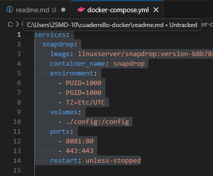
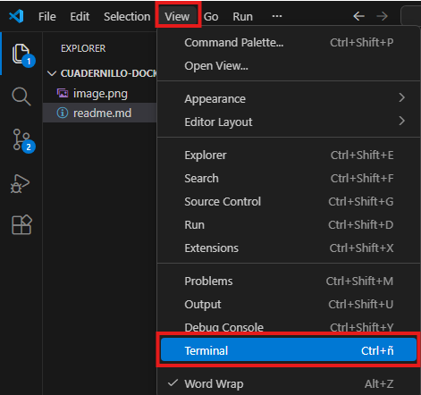
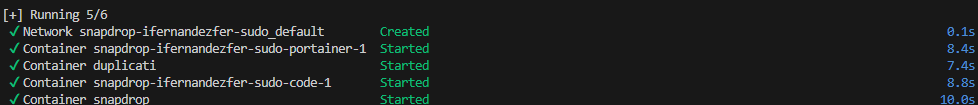

# Todos los servicio que hemos levantado hasta ahora y como levantarlos 
- [Todos los servicio que hemos levantado hasta ahora y como levantarlos](#todos-los-servicio-que-hemos-levantado-hasta-ahora-y-como-levantarlos)
  - [Como levantar un servicio:](#como-levantar-un-servicio)
  - [Servicios levantados hasta ahora:](#servicios-levantados-hasta-ahora)
    - [Portaner:](#portaner)
    - [Excalidraw:](#excalidraw)
    - [Apache:](#apache)
    - [VSCode:](#vscode)
    - [Duplicati:](#duplicati)
    - [Snapdrop:](#snapdrop)
    - [Kali linux:](#kali-linux)
    - [Wordpress y db:](#wordpress-y-db)
    - [File-browser:](#file-browser)
    - [Firefox:](#firefox)
    - [Obsidian:](#obsidian)
    - [Libreoffice:](#libreoffice)
    - [Jelllyfin:](#jelllyfin)
    - [Pihole:](#pihole)


## Como levantar un servicio:
Entrar a el codigo yml del documento y pegar el codigo del servicio que quieras levantar como se ve en esta foto:



Despues tienes que abrir la terminal en el ap
artado "View": 



Dentro de la terminal al escribir docker compose up -d:




Si tienes algun problema recuerda tener la aplicacion de Docker abierta o mirar si hay algo mal escrito en el codigo.


## Servicios levantados hasta ahora:
Si quieres levantar cualquiera de estos servicios solamente copia tu codigo en tu documento yml.

### Portaner:
```yml
  portainer:
    image: portainer/portainer-ce:latest
    container_name: portainer
    ports:
      - "9000:9000"
    volumes:
      - portainer_data:/data 
      - /var/run/docker.sock:/var/run/docker.sock 
    restart: unless-stopped
```

### Excalidraw:
```yml
  excalidraw:
    image: excalidraw/excalidraw:latest
    container_name: excalidraw_whiteboard
    ports:
      - "3030:80"
    restart: unless-stopped

```

### Apache:
```yml
  apache_web:
    image: httpd:latest
    container_name: apache_server
    ports:
      - "8081:80" 
    volumes:
      - ./data/apache_html:/usr/local/apache2/htdocs/ 
    restart: unless-stopped

```

### VSCode:
```yml
  vscode_server:
    image: lscr.io/linuxserver/codeserver:latest
    container_name: vscode_server
    environment:
      PUID: 1000
      PGID: 1000
      TZ: Europe/Madrid
    volumes:
      - ./config/vscode:/config
      - ./data/vscode_projects:/config/workspace 
    ports:
      - "8443:8443"
    restart: unless-stopped

```

### Duplicati:
```yml
  duplicati:
    image: lscr.io/linuxserver/duplicati:latest
    container_name: duplicati
    environment:
      PUID: 1000
      PGID: 1000
      TZ: Europe/Madrid
    volumes:
      - ./config/duplicati:/config
      - ./data/source_backups:/source 
      - ./data/dest_backups:/backups 
    ports:
      - "8200:8200"
    restart: unless-stopped

```

### Snapdrop:
```yml
  snapdrop:
    image: lscr.io/linuxserver/snapdrop:latest
    container_name: snapdrop
    environment:
      PUID: 1000
      PGID: 1000
      TZ: Europe/Madrid
    volumes:
      - ./config/snapdrop:/config
    ports:
      - "80:80"
    restart: unless-stopped
```

### Kali linux:
```yml
  kali-linux:
    image: lscr.io/linuxserver/kali-linux:latest
    container_name: kali_linux
    environment:
      PUID: 1000
      PGID: 1000
      TZ: Europe/Madrid
    volumes:
      - ./config/kali:/config
    ports:
      - "3002:3000"
    shm_size: "1gb"
    restart: unless-stopped
```

### Wordpress y db:
```yml
  wordpress:
    image: wordpress:latest
    container_name: wordpress_site
    ports:
      - "8000:80"
    environment:
      WORDPRESS_DB_HOST: db_wordpress
      WORDPRESS_DB_NAME: wordpress_db
      WORDPRESS_DB_USER: wordpress_user
      WORDPRESS_DB_PASSWORD: supersecretpassword
    volumes:
      - ./data/wordpress/html:/var/www/html
    restart: unless-stopped

  db_wordpress:
    image: mysql:8.0
    container_name: wordpress_db_container
    environment:
      MYSQL_ROOT_PASSWORD: root_supersecretpassword
      MYSQL_DATABASE: wordpress_db
      MYSQL_USER: wordpress_user
      MYSQL_PASSWORD: supersecretpassword
    volumes:
      - ./data/wordpress/db_data:/var/lib/mysql
    restart: unless-stopped
```

### File-browser:
```yml
  filebrowser:
    image: filebrowser/filebrowser:latest
    container_name: filebrowser
    environment:
      PUID: 1000
      PGID: 1000
      TZ: Europe/Madrid
    volumes:
      - ./config/filebrowser:/database.db
      - ./data/shared_files:/srv 
    ports:
      - "8080:80"
    restart: unless-stopped


```

### Firefox:
```yml
  firefox:
    image: jlesage/firefox:latest
    container_name: firefox_browser
    ports:
      - "5800:5800" 
    volumes:
      - ./config/firefox:/config:rw
    restart: unless-stopped

```


### Obsidian:
```yml
  syncthing_obsidian:
    image: lscr.io/linuxserver/syncthing:latest
    container_name: syncthing_obsidian
    environment:
      PUID: 1000
      PGID: 1000
      TZ: Europe/Madrid
    volumes:
      - ./config/syncthing:/config
      - ./data/obsidian_notes:/notes 
    ports:
      - "8384:8384" 
      - "22000:22000/tcp"
      - "21027:21027/udp"
    restart: unless-stopped

```

### Libreoffice:
```yml
  libreoffice:
    image: lscr.io/linuxserver/libreoffice:latest
    container_name: libreoffice
    security_opt:
      - seccomp=unconfined 
    environment:
      PUID: 1000
      PGID: 1000
      TZ: Europe/Madrid
    ports:
      - "3000:3000" 
      - "3001:3001" 
    volumes:
      - ./config/libreoffice:/config
    restart: unless-stopped

```

### Jelllyfin:
```yml
  jellyfin:
    image: jellyfin/jellyfin:latest
    container_name: jellyfin
    ports:
      - "${PORT_JELLYFIN}:8096"
    environment:
      - TZ=Etc/UTC
    volumes:
      - jellyfin_config:/config
      - ${RUTA_BASE}:/media
    restart: unless-stopped
volumes:
  jellyfin_config:
```

### Pihole:
```yml
  pihole:
    image: pihole/pihole:latest
    container_name: pihole
    ports:
      - "53:53/tcp" 
      - "53:53/udp" 
      - "8082:80"
      - "67:67/udp" 
    environment:
      TZ: Europe/Madrid
      WEBPASSWORD: "PonUnaContrasenaSeguraParaPiHole"
    volumes:
      - './config/pihole/etc-pihole:/etc/pihole'
      - './config/pihole/etc-dnsmasq.d:/etc/dnsmasq.d'
    restart: unless-stopped

volumes:
  portainer_data:
```